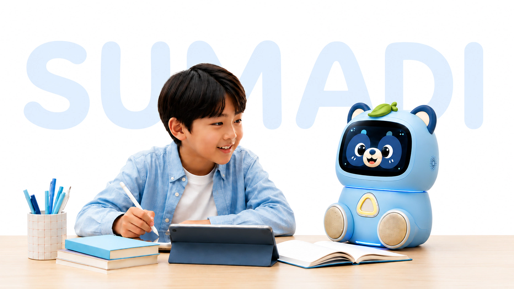
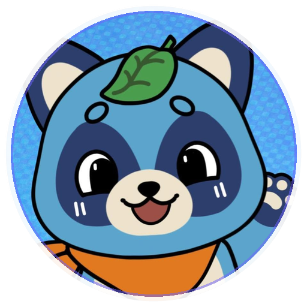

<h1 align="center">
  
</h1>

  📍 <b>Ho Chi Minh City, Vietnam</b> &nbsp;|&nbsp; 🧩 <b>Full-Stack Engineer</b> &nbsp;|&nbsp; 🤖 <b>Generative AI Engineer</b> &nbsp;|&nbsp; 🎓 <b>Final-year Software Engineering Student @ FPT University</b>

  
  
  

---

> "Who says you have to? You don’t have to be the greatest ever, you just have to be the greatest you."
>
> I build full-stack products with AI-heavy workflows: LLM applications, agentic copilots, RAG/context systems, evaluation loops, guardrail-minded product flows, and backend/frontend systems that turn hackathon ideas into working software.

## Tech I Work With

**Generative AI / AI systems:** LLM applications, RAG, prompt engineering, AI-assisted development workflows, evaluation harnesses, guardrails, knowledge-base design, AI output QA, Vietnamese language/slang data workflows. 
**Developer workflow:** Docker, AWS, Codex, Cursor, Kiro, Git, API testing, full-stack debugging, product documentation.

# Selected Work

## 🚀 Current Startup Project

  

 

<table>
  <tr>
    <td width="170" align="center">
      
    </td>
    <td>
      <h3>🤖 Mascoteach — EXE Funnovah</h3>
      

        Current EdTech startup project: a full-stack learning companion platform where teachers turn documents into quizzes/minigames, students interact with a Mascot AI, and the product expands across web, backend, AI service, Flutter mobile app, and Mascobot robot firmware.
      

      

        <a href="https://mascoteach.com"><b>Live Website</b></a> ·
        <a href="https://github.com/EXE-Funovah/Back-End">Backend</a> ·
        <a href="https://github.com/EXE-Funovah/Mascoteach-AI-Service">AI Service</a> ·
        <a href="https://github.com/EXE-Funovah/Mobile">Mobile</a>
      

      

        <b>Stack:</b> React/Vite, ASP.NET Core, TypeScript/Express/OpenAI, Flutter, SignalR/WebRTC-style interaction, ESP32/MK101 firmware.
      

    </td>
  </tr>
</table>

## 🏆 Hackathon & AI Product Work

- 📸 **[S.H.E.P.H.E.R.D.](https://github.com/VelJG/S.H.E.P.H.E.R.D)** — Built for **Agentic AI Build Week (AABW) Hackathon 2026** — **Top 6, Built with AWS Track**. Real-time venue safety dashboard combining YOLO-based people detection, zone-level crowd analytics, congestion prediction, alerts, and an operations copilot for dispatch recommendations. Built with React/Vite, FastAPI microservices, Docker Compose, and an OpenAI-compatible agent layer.

- 🥇 **VALSEA EdTech System Sprint (HCM)** — **1st Place Winner**. Selected after the hackathon to continue productizing the winning idea with VALSEA.

- 🎙️ **[SynthHunter](https://github.com/quanntm1206/LotusHack)** — **Top 21 Lotus Hack** project. Built a full-stack AI audio-forensics platform for detecting synthetic consultation recordings, using React/Vite, AWS Cognito, API Gateway, S3 uploads, DynamoDB verdict storage, and a Python ensemble pipeline combining XLS-R, Whisper, and pause-pattern analysis.

- 🎬 **[Launchly](https://github.com/AWS-Ballers/Unbound)** — Built for **Unbound Hack**. Full-stack GenAI launch-video workspace that turns GitHub repos, product URLs, and docs into AI-generated briefs, PixVerse-powered videos/images, editable launch assets, and shareable product packages using Next.js, Prisma/Postgres, OpenAI, and Auth.js.

## 🧠 Generative AI Products

- 📝 **Memora — VALSEA Client Productization Engagement** — Real Generative AI EdTech product engagement initiated after winning 1st place at the VALSEA EdTech System Sprint (HCM). Served as lead full-stack developer, turning the hackathon concept into a pitch-ready product over a 3-week sprint; integrated VALSEA transcription/translation/sentiment APIs, supported Vietnamese slang-heavy data preparation, and QA-tested AI outputs for edge cases, API faults, parameter behavior, and product-readiness gaps.
## ☁️ Cloud, Security & AWS

- 🛡️ **[AWS Incident Response Automation](https://github.com/VelJG/aws-incident-response-automation-cdk)** — **Top 1 internship project**. Automated AWS incident-response and forensics system using CDK, GuardDuty, EventBridge, Step Functions, Lambda, Kinesis Firehose, S3, Glue, Athena, Cognito, and a React dashboard to detect threats, isolate compromised resources, collect evidence, and support forensic investigation.

## 🧩 Full-Stack Engineering

- 🐱 **[LoafNCatting](https://github.com/VelJG/LoafNCattingPRN232)** — Full-stack cat-café operations platform with React/TypeScript frontend and ASP.NET Core backend. Covers reservations, ordering, admin workflows, JWT auth, SignalR chat/notifications, PayOS payment links, S3 media storage, EF Core SQL Server persistence, and automated tests.

## 🌱 Community & Leadership

- **FCAJ Community — Member → Program Administrator** — Active in the FCAJ community for nearly a year, learning AWS through hands-on workshops, peer support, and community-driven cloud projects. Recently stepped into a program administrator role, helping coordinate activities, support participants, and keep the learning program organized while deepening my practical understanding of AWS services and cloud architecture.
## 📚 Education

- **FPT University** — Final-year Bachelor of Software Engineering student `Oct 2023 – Dec 2027`

## Current Focus

- Building reliable LLM product workflows, not just one-off prompts.
- Practicing RAG, context engineering, AI evaluation harnesses, and guardrail patterns.
- Combining backend/product engineering with AI-heavy development workflows.
- Improving Vietnamese-language AI data handling, testing, and edge-case discovery.

## Still Human

<table>
  <tr>
    <td width="50%" valign="middle" align="center">
      

        Devoted Novelite 👁️‍🗨️    I like projects that feel alive: robots, AI copilots, interactive dashboards, weird prototypes, and products that make people smile before they notice the engineering underneath is serious.
      

      

       <b>We ball. Build it, break it, try again.</b>
      

    </td>
    <td width="50%" align="center" valign="middle">
      
       
      
    </td>
  </tr>
</table>
---

  
  

  

  

