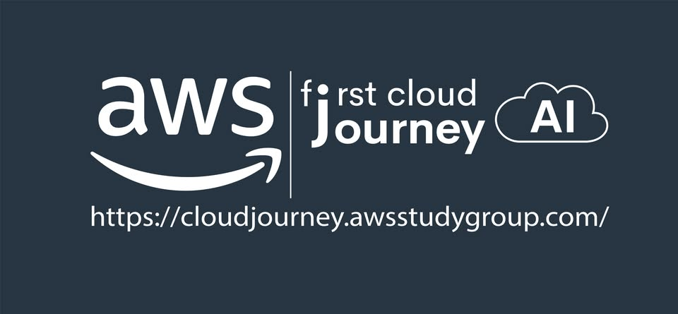

<h1 align="center">
  
</h1>

  📍 <b>Ho Chi Minh City, Vietnam</b> &nbsp;|&nbsp; 🛠️ <b>Software Engineer / Product Builder</b> &nbsp;|&nbsp; 🎓 <b>Final-year Software Engineering Student @ FPT University</b>

  
  
  

---

  <h2>“Who says you have to?”</h2>
  <h3>You don’t have to be the greatest ever. You just have to be the greatest you.</h3>

> I build software across AI, cloud, and product engineering: from computer vision and LLM workflows to backend services, mobile apps, and full-stack interfaces that turn ideas into working software.

## Tech I Work With

**AI / ML systems:** Computer vision, YOLO, ByteTrack, PyTorch, Transformers, Whisper/XLS-R, audio forensics, LLM applications, RAG workflow design, agentic AI/copilots, evaluation harnesses, guardrails, AI output QA, Vietnamese slang data workflows. 
**Cloud / Backend:** AWS, Docker, ECS/Fargate, S3, Lambda, Step Functions, GuardDuty, API Gateway, DynamoDB, FastAPI, ASP.NET Core, Node.js, REST APIs. 
**Developer workflow:** Git, GitHub, Postman, Codex, Cursor, Kiro, spec-driven development, full-stack debugging, product documentation.

# Selected Work

## 🚀 Current Startup Project

  

 

<table>
  <tr>
    <td width="170" align="center">
      
    </td>
    <td>
       <h3>🤖 Mascoteach — Funnovah</h3>
       

         Current EdTech startup product: an AI learning companion platform spanning web, backend, AI service, and Flutter mobile app. Designed document workflows for RAG features, including S3 storage, ownership metadata, extraction, chunking, and vectorization.
      

      

        <a href="https://mascoteach.com"><b>Live Website</b></a> ·
        <a href="https://github.com/EXE-Funovah/Back-End">Backend</a> ·
        <a href="https://github.com/EXE-Funovah/Mascoteach-AI-Service">AI Service</a> ·
        <a href="https://github.com/EXE-Funovah/Mobile">Mobile</a>
      

      

         <b>Stack:</b> React/Vite, ASP.NET Core, TypeScript/Express/OpenAI, Flutter, S3, and document-based RAG workflows.
      

    </td>
  </tr>
</table>

## 💼 Engineering Experience

I work across AI product engineering, cloud infrastructure, full-stack systems, and community-driven learning rather than staying inside one narrow role.

- **Funnovah — Product Engineering** · `2026 – Present` 
  Building Mascoteach across web, backend, AI service, and mobile; designed S3-backed document workflows for RAG features.

- **VALSEA - Memora — Product Engineering** · `Apr 2026 – May 2026` 
  Helped turn the VALSEA EdTech System Sprint (HCM) concept into a pitch-ready AI product MVP over 3 weeks. QA-tested 3 AI workflows---transcription, translation, and sentiment tracking---and prepared Vietnamese slang data.

- **AWS First Cloud Journey AI (FCAJ) — Cloud Engineering** · `Aug 2025 – Dec 2025` 
  Built AWS Incident Response Automation as an internship project. Orchestrated 3 containment actions---EC2 isolation, IAM quarantine, and ASG detachment---across GuardDuty, CloudTrail, and VPC Flow Logs, with an estimated low-volume cost of about **US$3/month**.

- **FCAJ — Community / Program Operations** · `2025 – Present` 
  Support AWS learning programs through workshop coordination, participant support, peer learning, and community operations.

## 🏆 Selected Projects

- 📸 **[S.H.E.P.H.E.R.D.](https://github.com/VelJG/S.H.E.P.H.E.R.D)** — **AABW 2026 project**. Computer-vision and agentic-AI operations dashboard using YOLO people detection, ByteTrack-style tracking, zone analytics, congestion prediction, alerts, and an operations copilot. Built with React/Vite, FastAPI, Python, OpenCV/YOLO, Docker, ECS/Fargate, DynamoDB, and AWS-oriented architecture.

- 🎙️ **[SynthHunter](https://github.com/quanntm1206/LotusHack)** — **Lotus Hack project**. AI-generated audio detection platform using React/Vite, AWS Cognito, API Gateway, S3, and a Python pipeline combining 3 signals: XLS-R features, Whisper encoder analysis, and pause-pattern statistics.

- 🛡️ **[AWS Incident Response Automation](https://github.com/VelJG/aws-incident-response-automation-cdk)** — Configurable AWS incident-response and forensics platform with automated resource isolation, IAM quarantine, evidence collection, ETL processing, Glue/Athena investigation, and a React dashboard.

## 🧩 Other Projects

- 🎬 **[Launchly](https://github.com/AWS-Ballers/Unbound)** — Full-stack GenAI launch-video workspace that turns GitHub repositories, product URLs, and documentation into AI-generated briefs, editable launch assets, and shareable product packages using Next.js, Prisma/Postgres, OpenAI, and Auth.js.

- 🐱 **[LoafNCatting](https://github.com/VelJG/LoafNCattingPRN232)** — Full-stack cat-café operations platform with React/TypeScript and ASP.NET Core, covering reservations, ordering, admin workflows, JWT authentication, SignalR notifications, PayOS payment links, S3 media storage, and SQL Server persistence.

## 🪪 Certifications

<!-- certifications:start -->
<table>
  <tr>
    <td align="center" width="180">
      
       
      <b>AWS Certified AI Practitioner</b>
       
      AWS · AI/ML · Generative AI
    </td>
    <td align="center" width="180">
      
       
      <b>AWS Certified Cloud Practitioner</b>
       
      AWS · Cloud · Security · Architecture
    </td>
  </tr>
</table>
<!-- certifications:end -->

 

## 🌱 Community & Leadership

  

 

- **FCAJ Community — Member → Program Administrator** — Active in the FCAJ community for nearly a year, learning AWS through hands-on workshops, peer support, and community-driven cloud projects. Recently stepped into a program administrator role, helping coordinate activities, support participants, and keep the learning program organized while deepening my practical understanding of AWS services and cloud architecture.

 

## 📚 Education

- **FPT University** — Bachelor of Software Engineering `Oct 2023 – Dec 2027`

## Current Focus

- Building reliable LLM product workflows, not just one-off prompts.
- Practicing RAG, context engineering, AI evaluation harnesses, and guardrail patterns.
- Combining backend/product engineering with AI-heavy development workflows.
- Improving Vietnamese-language AI data handling, testing, and edge-case discovery.

 

<table>
  <tr>
    <td width="50%" valign="middle" align="center">
      

        Devoted Novelite 👁️‍🗨️    I like projects that make me try new things: AI copilots, interactive dashboards, weird prototypes, and products that make people interested, cool things essentially.
      

      

       <b>We ball. Build it, break it, try again.</b>
      

    </td>
    <td width="50%" align="center" valign="middle">
      
       
      
    </td>
  </tr>
</table>
---

  
  

  

  

